# Code by Gustav - Fullstack Portfolio

Fullstack portfolio-webbplats byggd som examensarbete för Javautvecklare-utbildningen på Stockholms Tekniska Institut (JAVA24).

**Live:** https://gustavnyberg.se

## Screenshots

### Desktop

<p>
  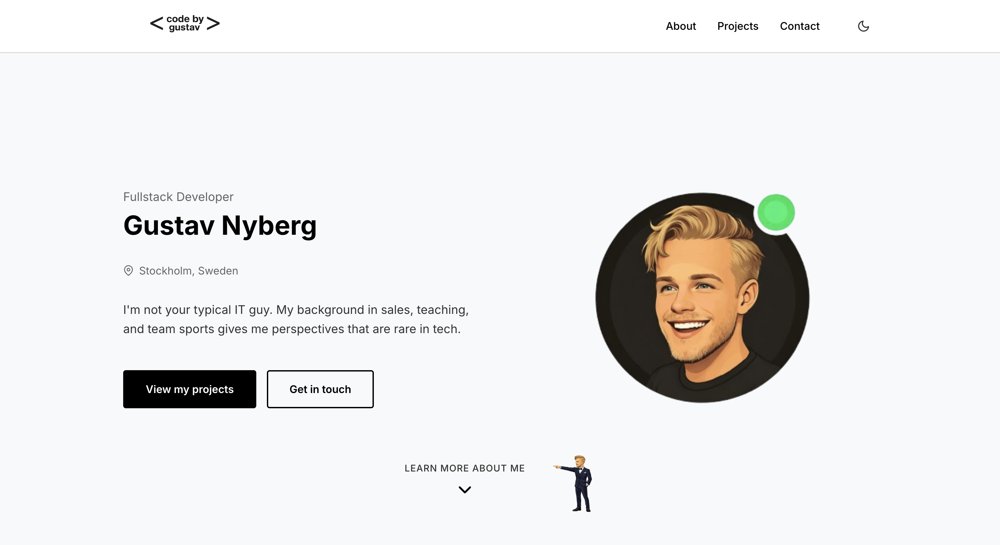
</p>

<p>
  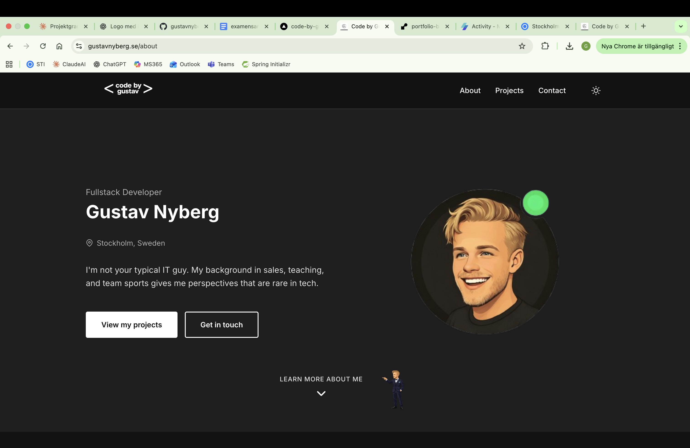
</p>

<p>
  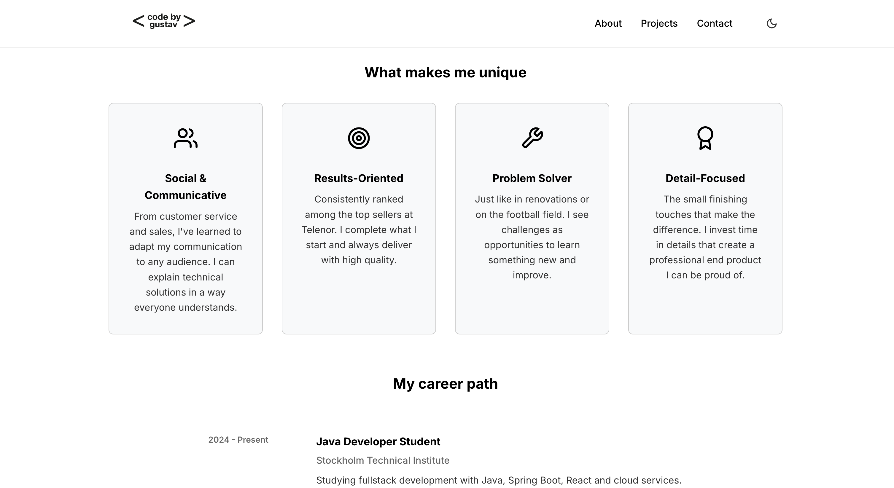
</p>

<p>
  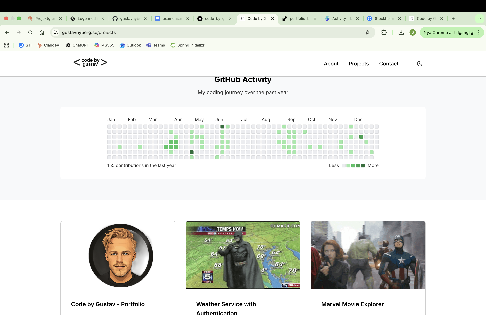
</p>

<p>
  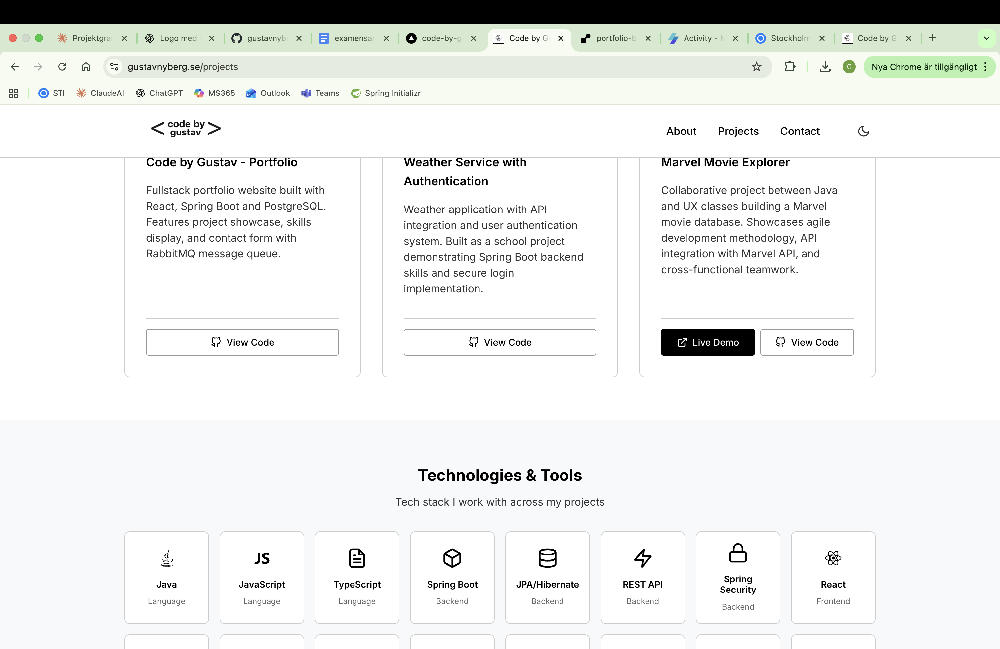
</p>

<p>
  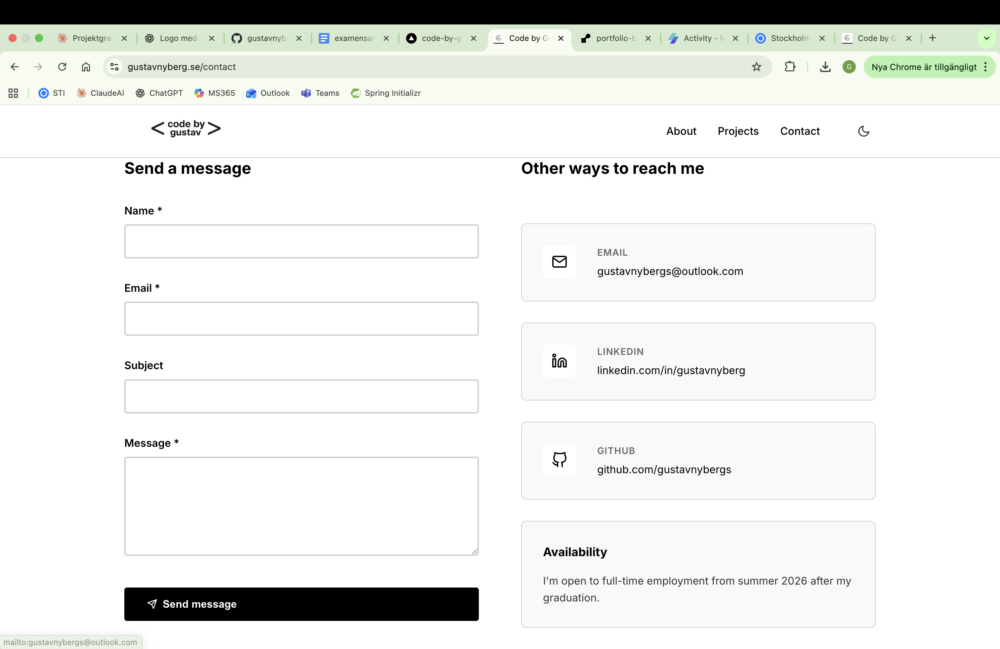
</p>

### Mobil

<p>
  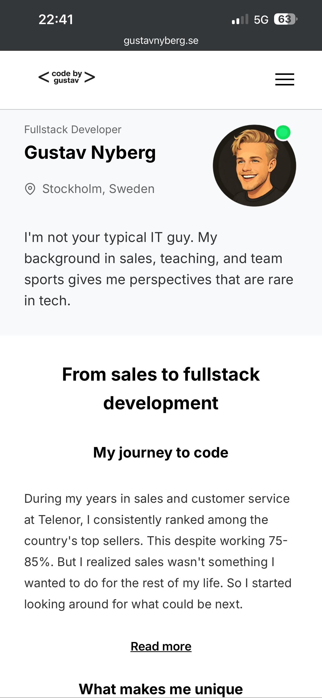
  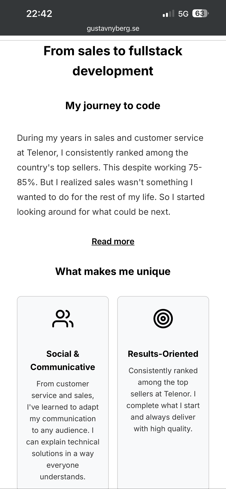
</p>

<p>
  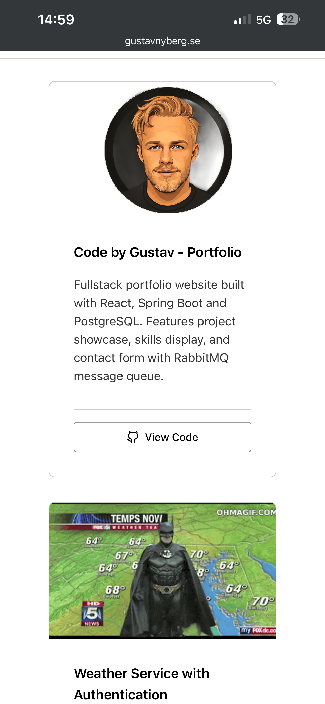
  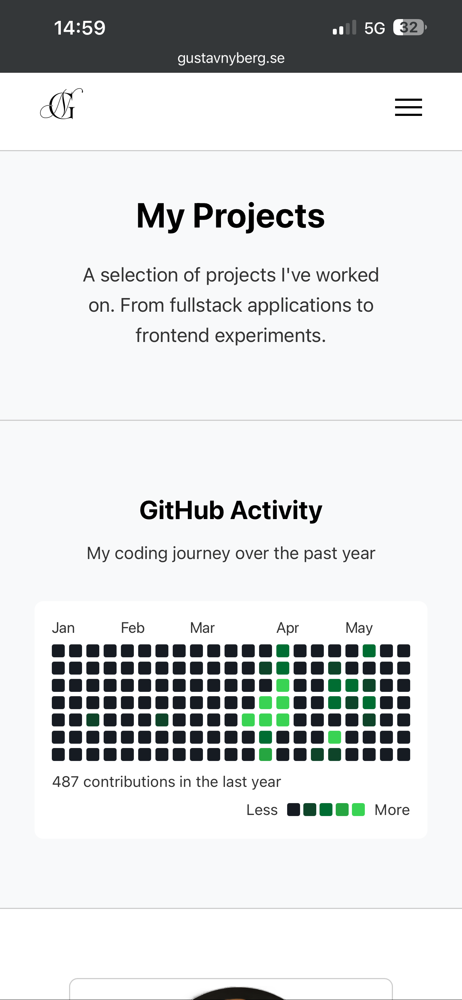
</p>

<p>
  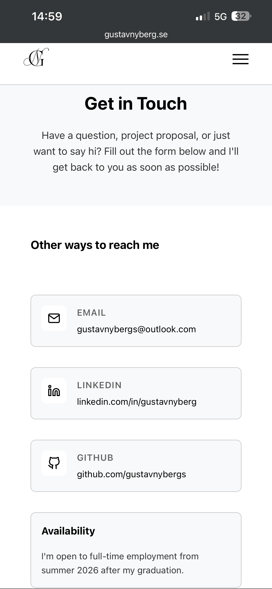
  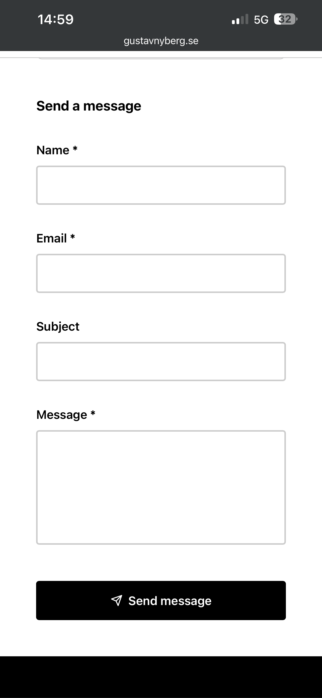
</p>

---

## Om projektet

Denna portfolio syftar till att visa min kompetens som fullstack-utvecklare för potentiella arbetsgivare och rekryterare. Min bakgrund från sälj, kundtjänst och undervisning har gett mig en kombination av teknisk förmåga och kommunikationsförmåga som gör att jag kan översätta mellan affärsbehov och tekniska lösningar.

## Tech Stack

**Frontend**
- React 18
- React Router
- CSS
- Vercel (hosting)

**Backend**
- Java 17
- Spring Boot 3.2
- Spring Data JPA
- RabbitMQ (message queue)
- MailerSend (email-notifikationer)
- Render (hosting)

**Databas**
- PostgreSQL (produktion)
- MySQL (lokal utveckling via Docker)

## Funktioner

- Responsiv design (mobile-first)
- Dark mode
- Kontaktformulär med asynkron meddelandehantering via RabbitMQ
- Email-notifikationer via MailerSend API
- Optimistiskt UI för snabb användarfeedback
- GitHub Activity-kalender
- Custom domän

## Tester

Projektet har 28 automatiserade tester:

**Backend (22 tester)**
- ContactControllerTest: REST-endpoint, validering, rate limiting
- ContactMessageTest: Modell-validering
- EmailServiceTest: Email-integration
- ContactMessageConsumerTest: RabbitMQ-konsument
- RateLimiterServiceTest: Rate limiting-logik

**Frontend (6 tester)**
- App.test.js: Routing och sidladdning
- ContactForm.test.js: Formulärvalidering

Kör tester:
```bash
# Backend
cd backend && mvn test

# Frontend
cd frontend && npm test
```

## Säkerhet

- **Rate limiting:** Max 5 requests per minut per IP för kontaktformuläret
- **Input-validering:** Bean Validation på backend, client-side validering på frontend
- **CORS-konfiguration:** Endast tillåtna domäner kan anropa API:et
- **Miljövariabler:** Känslig data (API-nycklar, databasuppgifter) lagras som environment variables

## Projektstruktur
```
portfolio/
├── frontend/          # React-applikation
├── backend/           # Spring Boot API
├── docker-compose.yml # Lokal utvecklingsmiljö
└── README.md
```

## Lokal utveckling

### Förutsättningar
- Node.js 18+
- Java 17+
- Docker

### Starta med Docker
```bash
docker-compose up --build
```

Frontend körs på http://localhost:3000
Backend körs på http://localhost:8080

---

## Reflektioner och lärdomar

### CORS - när frontend och backend vägrar prata med varandra

CORS var något jag hade arbetat med tidigare under utbildningen, men mest i lokal utvecklingsmiljö. Att hantera det mellan två olika hostingtjänster var nytt. Felet "Access-Control-Allow-Origin" dök upp direkt när jag försökte koppla ihop Vercel och Render.

Lösningen var att konfigurera backend så att den tillåter anrop från min frontend-domän. Men det slutade inte där. Vercel genererar nya preview-URLs vid varje deploy, så jag fick använda wildcard-patterns för att tillåta alla Vercel-domäner. Sen när jag la till min custom domän (gustavnyberg.se) fick jag uppdatera CORS-konfigurationen igen.

### Email-leverans - från Gmail till MailerSend

Jag hade satt upp email-notifikationer med Gmail SMTP och det fungerade perfekt lokalt. Varje gång någon skickade ett meddelande via kontaktformuläret fick jag ett mail.

Sen deployade jag till Render och ingenting hände. Inga felmeddelanden, bara tystnad. Efter felsökning visade det sig att Render blockerar utgående trafik på SMTP-portar. Första lösningen blev SendGrid som använder ett API istället för SMTP. Det fungerade bra ett tag, men leveransen till Microsoft-adresser (Outlook, Hotmail) var opålitlig.

Till slut migrerade jag till MailerSend med en verifierad egen domän (noreply@gustavnyberg.se). Det krävde DNS-konfiguration med SPF och DKIM, men resultatet är pålitlig leverans till alla mottagare.

### Beslutet att hårdkoda project- och skills-data

Från början hämtade frontend all data från backend via REST API. Projekten, skills, allt låg i databasen. Det kändes som rätt sätt att göra det på som fullstack-utvecklare vid deployment.

Men laddningstiden blev lidande. Varje gång någon besökte sidan fick de vänta på att backend skulle svara. Till slut tog jag beslutet att hårdkoda projekten och skills direkt i frontend. Det kändes först som att fuska lite, men egentligen är det ett pragmatiskt val. Den datan ändras sällan och nu laddar sidan direkt. Backend används fortfarande för kontaktformuläret där dynamik faktiskt behövs.

### RabbitMQ - message queue för kontaktformuläret

RabbitMQ hade vi nyligen använt i ett skolprojekt så jag visste vad det var. Det kändes logiskt att använda det här också. Om något tillfälligt inte fungerar, till exempel om email-tjänsten är nere, så försvinner inte meddelandet utan ligger kvar i kön tills det kan processas.

Det krångliga var att få det att fungera i produktion. Lokalt körde jag RabbitMQ i Docker, men för Render behövde jag en extern tjänst (CloudAMQP). Det blev många environment variables att hålla reda på.

### Felsökning av duplicerade mappar

Det här var ett av de mer förvirrande problemen. Saker fungerade inte som förväntat och felmeddelanden pekade åt olika håll.

Efter felsökning visade det sig att jag av misstag hade duplicerat frontend-mappen. En låg inuti frontend-mappen där den skulle vara, och en hade hamnat utanför. När jag redigerade filer för att få det som jag ville så ändrade jag i fel mapp, vilket gjorde att ändringarna aldrig gav förväntat resultat.

Lärdomen är att alltid dubbelkolla filstrukturen när något inte beter sig som det ska.

---

## Sammanfattning

Det här projektet har lärt mig att deployment är minst lika utmanande som själva utvecklingen. Saker som fungerar lokalt kan bete sig annorlunda i produktion. CORS, miljövariabler, tjänstebegränsningar - allt kräver sin egen felsökning.

Men det har också lärt mig att det är okej att ändra sig. Att gå från dynamisk data till hårdkodad data var inte ett steg bakåt, det var ett pragmatiskt val som förbättrade användarupplevelsen.

---

## Författare

Gustav Nyberg  
JAVA24, Stockholms Tekniska Institut  
gustavnybergs@outlook.com

## Live Demo

https://gustavnyberg.se